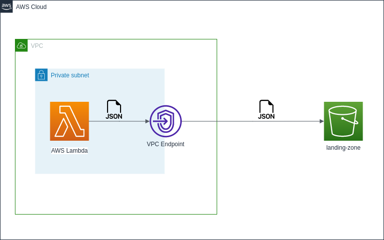

# Projeto de Infraestrutura AWS com Terraform



Este é um projeto de exemplo que será apresentado em uma live sobre o uso do Terraform para provisionar infraestrutura na AWS. O projeto consiste em criar uma infraestrutura básica na AWS, incluindo os seguintes recursos:

- VPC (Virtual Private Cloud);
- Sub-rede dentro da VPC;
- Grupo de segurança para a sub-rede e função Lambda;
- Gateway Endpoint para trafegar dados entre a Lambda dentro da Sub-rede e o Bucket s3;
- Função Lambda para execução manual;
- Bucket S3 para armazenar dados;

## Pré-requisitos

Antes de executar este projeto, você precisará ter os seguintes pré-requisitos instalados em sua máquina:

- [Terraform](https://www.terraform.io/downloads.html) (versão 0.12 ou superior)
- [AWS CLI](https://aws.amazon.com/cli/) configurado com suas credenciais de acesso à conta AWS

## Instruções de execução

1. Clone este repositório em sua máquina:

   ```bash
   git clone <URL_DO_REPOSITORIO>
   cd projeto-terraform-aws

2. Acesse o diretório do projeto:

    ```
    cd terraform-aws-example
    ```

3. Certifique-se de ter o AWS CLI instalado em sua máquina. Caso não tenha, siga as instruções abaixo para instalar o AWS CLI:

- Windows: Você pode baixar o instalador do AWS CLI em [aws.amazon.com/cli](https://aws.amazon.com/cli). Execute o instalador e siga as instruções para concluir a instalação.

- macOS: Você pode instalar o AWS CLI usando o Homebrew, executando o seguinte comando no terminal:

    ```
    brew install awscli
    ```

- Linux: Você pode instalar o AWS CLI usando o gerenciador de pacotes de sua distribuição Linux. Por exemplo, no Ubuntu, você pode executar o seguinte comando:

    ```
    sudo apt-get install awscli
    ```

4. Configure o AWS CLI com suas credenciais de acesso à conta AWS. Execute o seguinte comando no terminal:

    ```
    aws configure
    ```

Será solicitado que você informe sua access_key e secret_key, que são fornecidas pelo AWS IAM. Além disso, você também precisará definir a region desejada, como por exemplo us-east-1. Essas informações serão armazenadas no arquivo de configuração do AWS CLI.

5. Inicialize o Terraform:

    ```
    terraform init
    ```

6. Execute o comando terraform apply para criar a infraestrutura:

    ```
    terraform apply
    ```

Será solicitada uma confirmação para executar o plano de criação da infraestrutura. Digite yes e pressione Enter.

O Terraform começará a criar os recursos na AWS. Aguarde até que o processo seja concluído.

Após a conclusão, o Terraform exibirá uma mensagem indicando que a infraestrutura foi criada com sucesso.

Você pode executar manualmente a função Lambda criada acessando o Console da AWS ou usando o AWS CLI. Certifique-se de ter as permissões necessárias para executar a função.

7. Para destruir a infraestrutura criada, execute o comando terraform destroy:

    ```
    terraform destroy
    ```
Será solicitada uma confirmação para destruir a infraestrutura. Digite yes e pressione Enter.

O Terraform começará a destruir os recursos criados na AWS. Aguarde até que o processo seja concluído.

Após a conclusão, o Terraform exibirá uma mensagem indicando que a infraestrutura foi destruída com sucesso.

Recursos adicionais
Além dos arquivos incluídos neste repositório, você também pode encontrar documentação adicional sobre o uso do Terraform na [documentação oficial do Terraform](https://developer.hashicorp.com/terraform/docs) e na [documentação da AWS](https://docs.aws.amazon.com/index.html).